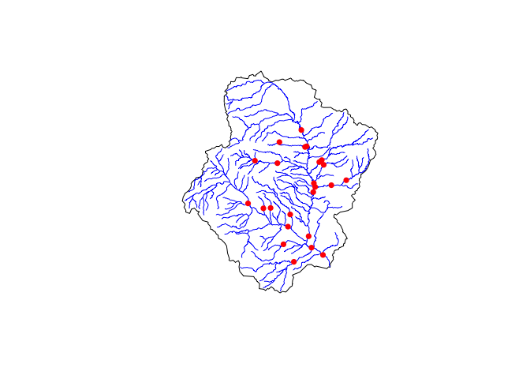
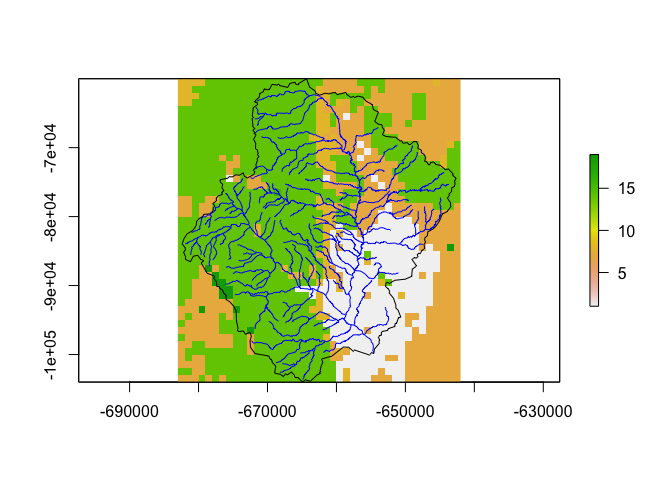

<!-- README.md is generated from README.Rmd. Please edit that file -->

# TL;DR

Subsetting appropriate domains from the NWM CONUS files is a challenge.
These tools make the process straight forward. The downside is you must
have NCO tools installed locally, and \~17GB of disk space to store the
National Domain Files.

Tools for downloading and processing NLDAS forcing files are also
included, but again these come with needed local disk space needs. The
workflow is illustrated below.

**Acknowledgments**: The subsetting code is inspired by the code written
by Aubrey Dugger. It has been tweaked to work quicker on local laptops
by removing some intensive processes and dependencies, and working with
`RNetCDF`, `raster`, `dplyr` and `sf`.

# wrfhydroSubsetter

WRF-Hydro is the core model behind the NOAA National Water Model. The
domain files for the NWM Water Model are a great resource for creating
model subsets to run locally. Creating these subsets however poses a
major challenge.

While the [CUASHI subsetting](https://subset.cuahsi.org/) service does
exist and is great, there are two principle disadvantages. The first is
the point and click interface makes creating many subsets an arduous
task. The second, is that it limits the user to requesting subsets by
HUC12 units or by a point-and-click bounding box coordinates. The
downside to this is, that to effectively run a watershed model, the
domain must include the head water region.

Neither arbitrary BBOX calls, or HUC12 units ensure this.

As such we aim to create a set of tools that are more flexible, and more
easily integrated with existing data science workflows including
`dataRetrieval` Network Linked Data Index Client.

# Aquiring the Domain Files

This approach does not come with out disadvantages, namely that you must
have the CONUS domain files locally. These files require \~17 GB of disk
space and can be downloaded with `download_conus_nwm` which will go and
download the most current domain files for you in to a defined
directory. They will be place is a sub directory name `nwmCONUS-v204`,
where the vXXX is the version.

``` r
library(wrfhydroSubsetter)
out_dir = "/Volumes/Transcend/"
domain_files = download_conus_nwm(outDir = out_dir)
```

# Defining an AOI

Let’s imagine we want the head water catchment of a location near
Fountain Creek in Colorado Springs.

``` r
library(dataRetrieval)

fountainCreek <- findNLDI(location = c(-104.780837, 38.786796), 
                          nav = "UT", 
                          find = c("nwis", "basin", "flowlines"))


{plot(fountainCreek$basin)
plot(fountainCreek$UT_flowlines$geometry, col = 'blue', add = TRUE)
plot(fountainCreek$UT_nwissite$geometry, col = "red", pch = 16, add = TRUE)}
```



``` r
# Size of the basin
units::set_units(sf::st_area(fountainCreek$basin), "km2")
#> 1080.289 [km^2]
```

# Model Subseting

Great! With our AOI, lets get our subset model files:

``` r
subset_files = paste0(out_dir, "/fountain_Creek3/")

subset_wrf_hydro_domain(AOI = fountainCreek$basin,  
                        domain_files = domain_files,  
                        outDir = subset_files)
#> [1] "/Volumes/Transcend//fountain_Creek3//"
```

# Viewing the files / sanity check

``` r
library(raster)

# What did we make?
list.files(subset_files)
#> [1] "Fulldom_hires.nc"                    "geo_em.d0x.nc"                      
#> [3] "GEOGRID_LDASOUT_Spatial_Metadata.nc" "GWBUCKPARM.nc"                      
#> [5] "hydro2dtbl.nc"                       "Route_Link.nc"                      
#> [7] "soil_properties.nc"                  "spatialweights.nc"                  
#> [9] "wrfinput_d0x.nc"

# Looking at the geogrid
geo  = list.files(subset_files, "geo", full.names = TRUE)

# What variable names are available?
var_names(geo)
#>  [1] "ALBEDO12M"  "CLAT"       "CLONG"      "CON"        "COSALPHA"  
#>  [6] "E"          "F"          "GREENFRAC"  "HGT_M"      "LAI12M"    
#> [11] "LAKE_DEPTH" "LANDMASK"   "LANDUSEF"   "LU_INDEX"   "MAPFAC_M"  
#> [16] "MAPFAC_MX"  "MAPFAC_MY"  "MAPFAC_U"   "MAPFAC_UX"  "MAPFAC_UY" 
#> [21] "MAPFAC_V"   "MAPFAC_VX"  "MAPFAC_VY"  "OA1"        "OA2"       
#> [26] "OA3"        "OA4"        "OL1"        "OL2"        "OL3"       
#> [31] "OL4"        "SCB_DOM"    "SCT_DOM"    "SINALPHA"   "SLOPECAT"  
#> [36] "SNOALB"     "SOILCBOT"   "SOILCTOP"   "SOILTEMP"   "Times"     
#> [41] "VAR"        "VAR_SSO"    "XLAT_M"     "XLAT_U"     "XLAT_V"    
#> [46] "XLONG_M"    "XLONG_U"    "XLONG_V"

# Let build a raster from the land cover grid
r = make_empty_geogrid_raster(geo, var = "LU_INDEX")

{plot(r)
plot(st_transform(fountainCreek$basin, r@crs), add = T)
plot(st_transform(fountainCreek$UT_flowlines, r@crs), col = "blue", add = TRUE)}
```


